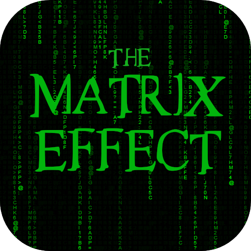

<p align="center">	
	<h1 align="center">O Efeito Matrix</h1>
</p>
<p align="center">
    
</p>
    <p align="center">O incrível efeito da chuva de letras no estilo da trilogia Matrix.</p>
    <p align="center">
        
        
        
        
        
        
        
        
  	</p>
</p>

<p align="center">
	
</p>

> ### "Cedo ou tarde, você vai aprender, assim como eu aprendi, que existe uma diferença entre CONHECER o caminho e TRILHAR o caminho" 
>_Morpheus_

## Traduções

* [Original](https://github.com/JefersonLucas/the-matrix-effect/blob/master/README.md)
* [English](https://github.com/JefersonLucas/the-matrix-effect/blob/master/translate/en/README.md)

## Começando

Essas instruções fornecerão uma cópia do projeto em execução na sua máquina local.

### Instalando
Siga passo a passo as seguinte formas de obter o código na sua máquina local.

#### Clonando o repositório

Para clonar o esse repositório na sua máquina local, utilize as linhas de comando:

```
#Clonar com SSH

mkdir the-matrix-effect
cd the-matrix-effect
git init
git clone git@github.com:JefersonLucas/the-matrix-effect.git
```

```
#Clonar com HTTPS

mkdir the-matrix-effect
cd the-matrix-effect
git init
git clone https://github.com/JefersonLucas/the-matrix-effect.git
```

#### Baixando o repositório

Você também pode [baixar](https://github.com/JefersonLucas/the-matrix-effect/archive/master.zip) o repositório em formato zip.

## Ambiente

Veja aqui o a página do projeto implantado por @github-pages [ver implantação](https://jefersonlucas.github.io/the-matrix-effect/).

## Contribuindo

Leia o [CONTRIBUTING.md](https://github.com/JefersonLucas/the-matrix-effect/blob/master/CONTRIBUTING.md) para obter detalhes sobre nosso código de conduta e o processo para enviar solicitações pull para nós.

## Versionamento

Usamos o [SemVer](https://semver.org/lang/pt-BR/) para controle de versão. Para as versões disponíveis, consulte as [tags nesse repositório](https://github.com/JefersonLucas/the-matrix-effect/tags).

## Autores

* [@JefersonLucas](https://github.com/JefersonLucas) - _Trabalho Inicial_.

Veja também a lista completa de [contribuidores](https://github.com/JefersonLucas/the-matrix-effect/contributors) que participaram deste projeto.

## Licença

Este projeto está licenciado sob a licença MIT - consulte o arquivo [LICENSE.md](https://github.com/JefersonLucas/the-matrix-effect/blob/master/LICENSE) para obter detalhes.

## Agradecimentos

Meus sinceros agradecimentos:

* A Deus.
* Contribuintes do projeto.
* Todos que visitam o projeto e deixa uma estrela como reconhecimento.
* Trilogia _Matrix_ com o fodástico _Keanu Reeves_.
* Ao _[Sylvain Saurel](https://play.google.com/store/apps/details?id=com.ssaurel.matrixeffect)_, sem o seu trabalho, não me inspiraria a realizaria esse projeto.
